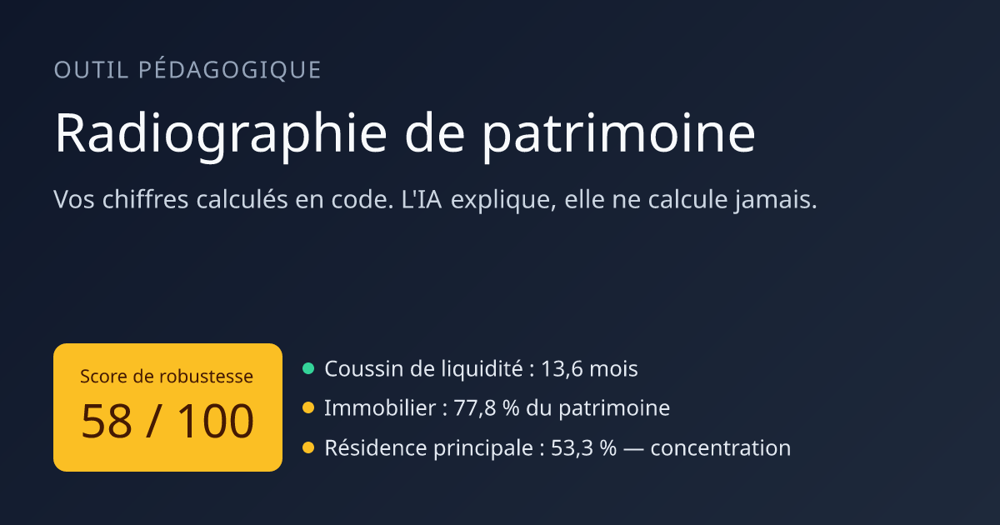
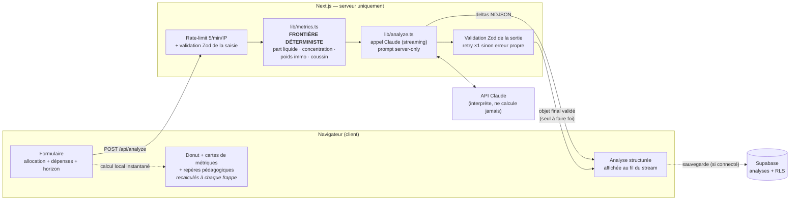

<div align="center">



# Radiographie de patrimoine

**Outil pédagogique d'allocation patrimoniale.**<br/>
Vos chiffres sont calculés en code — l'IA explique, elle ne calcule jamais.

<a href="https://s-investir-demo.vercel.app"></a>

[](https://github.com/nash3691215/S-INVESTIR-DEMO/actions/workflows/ci.yml)


<i>Analyse complète visible à l'ouverture — sans compte, sans saisie, en moins d'une seconde.</i>

</div>

---

L'utilisateur saisit la répartition de son patrimoine ; l'application calcule
des **métriques objectives** (code déterministe, testé), puis en génère une
**lecture pédagogique structurée** via l'API Claude, streamée à l'écran.
L'angle est éducatif — comprendre ses angles morts — et non du conseil en
investissement réglementé.

---

## Sommaire

- [Architecture](#architecture)
- [Trois invariants d'architecture](#trois-invariants-darchitecture)
- [Expérience : zéro attente](#expérience--zéro-attente)
- [Garde-fous & coûts](#garde-fous--coûts)
- [Installation locale](#installation-locale)
- [Tests](#tests)
- [Variables d'environnement](#variables-denvironnement)
- [Configuration Supabase (copier-coller)](#configuration-supabase-copier-coller)
- [Déploiement sur Vercel](#déploiement-sur-vercel)
- [Structure du projet](#structure-du-projet)

---

## Architecture



Le client calcule les mêmes métriques en local pour l'aperçu instantané ; le
serveur **recalcule tout** et ne fait jamais confiance à la saisie.

---

## Trois invariants d'architecture

1. **Frontière déterministe / IA.** Tous les calculs vivent dans
   [`lib/metrics.ts`](lib/metrics.ts) : part liquide en %, concentration maximale
   (actif le plus lourd + son poids), poids immobilier total, coussin de
   liquidité (actifs liquides ÷ dépenses mensuelles = mois couverts). L'API
   Claude ne reçoit que ces chiffres **déjà calculés**. Le LLM interprète, il ne
   calcule jamais.

2. **Appel Claude côté serveur uniquement.** Route
   [`app/api/analyze/route.ts`](app/api/analyze/route.ts). La clé est lue dans
   `process.env.ANTHROPIC_API_KEY`. Le prompt système (la grille d'analyse) vit
   dans [`lib/prompt.ts`](lib/prompt.ts), importé via `server-only` — jamais dans
   le bundle client.

3. **Sortie JSON validée.** Claude répond en JSON strict, validé par Zod
   ([`lib/schema.ts`](lib/schema.ts)) :
   `{ synthese, forces[], vigilances[{titre, principe, detail}], pistes[], score_robustesse }`.
   La réponse est **streamée** pour l'affichage progressif, mais seul l'objet
   final validé fait foi ; en cas d'échec de parse/validation, **un retry**
   non-streamé, puis une erreur propre.

**Mode invité** : l'application est pré-remplie avec un profil de démonstration
réaliste (≈ 78 % d'immobilier, peu de liquide). On peut lancer une analyse
complète **sans créer de compte** — seule la sauvegarde dans l'historique exige
une connexion.

---

## Expérience : zéro attente

- **À l'ouverture** : une radiographie complète du profil de démo s'affiche
  en < 1 s. Elle a été générée une fois par le vrai pipeline puis figée dans
  [`lib/demo-analysis.json`](lib/demo-analysis.json) — aucun appel API par
  visiteur, aucun contenu inventé à la main.
- **Sur saisie personnalisée** : la réponse du modèle est streamée en NDJSON
  (`metrics` → `delta`… → `done`). Le client répare le JSON tronqué au fil de
  l'eau ([`lib/partial-json.ts`](lib/partial-json.ts)) : le texte apparaît en
  ~1 s et l'analyse se construit sous les yeux.
- **Pendant la saisie** : la grille pédagogique est aussi appliquée en code
  (`assessMetrics`) — coussin ≥ 3 mois, concentration ≤ 50 %, immobilier
  ≤ 60 %, volatilité selon l'horizon. Les verdicts et le compteur « x/4 au
  vert » réagissent à chaque frappe, sans IA.

---

## Garde-fous & coûts

Chaque requête admise déclenche un appel modèle payant (~1 centime). D'où :

| Garde-fou | Implémentation |
| --- | --- |
| Rate-limiting | 5 requêtes/min/IP, fenêtre glissante, `429` + `Retry-After` ([`lib/rate-limit.ts`](lib/rate-limit.ts)) |
| Bornes d'input | Montants plafonnés dans le schéma Zod (1 Md€/classe), revalidés côté serveur |
| Analyse de démo figée | Le trafic de consultation ne coûte **rien** : seul un profil modifié déclenche le modèle |
| Sortie sous contrat | JSON strict validé, retry unique, erreur propre — jamais de sortie brute affichée |

Limite assumée : le compteur de rate-limit est en mémoire, donc **par instance
serverless** (documenté dans le code ; un durcissement réel passerait par un
compteur partagé type Upstash/KV).

---

## Installation locale

Prérequis : **Node.js ≥ 18.17** et npm.

```bash
# 1. Installer les dépendances
npm install

# 2. Configurer les variables d'environnement
cp .env.example .env.local
#   puis renseignez les valeurs (voir section suivante)

# 3. Lancer en développement
npm run dev
```

L'application est disponible sur http://localhost:3000.

> **Sans configuration** : tant que `ANTHROPIC_API_KEY` n'est pas renseignée,
> l'analyse de démo, l'aperçu des métriques et les repères fonctionnent
> (calcul déterministe local) ; relancer une radiographie affichera une erreur
> propre. Sans Supabase, l'outil reste pleinement utilisable en **mode
> invité**.

Vérifier la production avant déploiement :

```bash
npm run build      # doit passer sans erreur ni warning
npm run typecheck  # vérification de types stricte
npm run lint       # ESLint (next/core-web-vitals)
```

---

## Tests

```bash
npm test           # Vitest, ~100 ms
```

La stratégie : **tester ce qui doit l'être** — la couche déterministe, pas le
LLM. 30+ tests couvrent :

- `computeMetrics` : cas de référence du profil de démo, arrondis, montants
  invalides, patrimoine vide ;
- `assessMetrics` : bornes exactes des repères (50 % pile, 60 % pile, 3 mois
  pile) et les quatre verdicts ;
- `parsePartialAnalysis` : aucune exception quel que soit le point de
  troncature du stream, aperçus monotones, échappements, clés orphelines ;
- `checkRateLimit` : rafale, fenêtre glissante, indépendance des IP.

La CI ([`.github/workflows/ci.yml`](.github/workflows/ci.yml)) rejoue
lint + types + tests + build à chaque push.

---

## Variables d'environnement

Toutes décrites dans [`.env.example`](.env.example).

| Variable                        | Côté    | Rôle                                                            |
| ------------------------------- | ------- | --------------------------------------------------------------- |
| `ANTHROPIC_API_KEY`             | Serveur | Clé API Claude. **Jamais** exposée au client.                   |
| `NEXT_PUBLIC_SUPABASE_URL`      | Client  | URL du projet Supabase.                                         |
| `NEXT_PUBLIC_SUPABASE_ANON_KEY` | Client  | Clé anon Supabase (sécurité assurée par le RLS).                |
| `NEXT_PUBLIC_SITE_URL`          | Client  | URL publique, pour la redirection du magic link.                |

---

## Configuration Supabase (copier-coller)

### 1. Créer le projet

Créez un projet sur [supabase.com](https://supabase.com), puis récupérez l'URL
et la clé **anon** dans **Project Settings → API**. Reportez-les dans
`.env.local`.

### 2. Créer la table + activer le RLS

Ouvrez **SQL Editor → New query**, collez ce script, exécutez. Il est
idempotent (ré-exécutable sans risque) — il est aussi versionné dans
[`supabase/schema.sql`](supabase/schema.sql).

```sql
-- 1. Table des analyses
create table if not exists public.analyses (
  id          uuid        primary key default gen_random_uuid(),
  user_id     uuid        not null references auth.users (id) on delete cascade,
  created_at  timestamptz not null default now(),
  snapshot    jsonb       not null,   -- { input, metrics }
  result      jsonb       not null    -- l'analyse renvoyée par Claude
);

create index if not exists analyses_user_created_idx
  on public.analyses (user_id, created_at desc);

-- 2. Row Level Security : chaque utilisateur ne voit que ses propres lignes
alter table public.analyses enable row level security;

drop policy if exists "Lecture de ses propres analyses" on public.analyses;
create policy "Lecture de ses propres analyses"
  on public.analyses for select
  using (auth.uid() = user_id);

drop policy if exists "Insertion de ses propres analyses" on public.analyses;
create policy "Insertion de ses propres analyses"
  on public.analyses for insert
  with check (auth.uid() = user_id);

drop policy if exists "Suppression de ses propres analyses" on public.analyses;
create policy "Suppression de ses propres analyses"
  on public.analyses for delete
  using (auth.uid() = user_id);
```

### 3. Activer l'authentification par e-mail (magic link)

Dans **Authentication → Providers → Email**, activez **Email** et le mode
**Magic Link**. Dans **Authentication → URL Configuration**, ajoutez vos URLs de
redirection :

- `http://localhost:3000/auth/callback` (développement)
- `https://votre-app.vercel.app/auth/callback` (production)

C'est tout : la table, le RLS et l'auth sont prêts.

---

## Déploiement sur Vercel

1. Poussez le dépôt sur GitHub.
2. Sur [vercel.com](https://vercel.com), **Import Project** → sélectionnez le
   dépôt. Next.js est détecté automatiquement.
3. Dans **Settings → Environment Variables**, ajoutez les quatre variables
   ci-dessus. Pour `NEXT_PUBLIC_SITE_URL`, utilisez l'URL Vercel finale
   (`https://votre-app.vercel.app`).
4. **Deploy.**
5. Retournez dans Supabase (**Authentication → URL Configuration**) et ajoutez
   l'URL de callback de production.

---

## Structure du projet

<details>
<summary><b>Déplier l'arborescence commentée</b></summary>

```
app/
  api/analyze/route.ts      # SEUL appel à Claude : rate-limit → valide → calcule → streame
  api/og/route.tsx          # image Open Graph générée (next/og)
  auth/callback/route.ts    # échange du code magic link contre une session
  auth/signout/route.ts     # déconnexion
  history/page.tsx          # historique de l'utilisateur (lecture RLS)
  login/page.tsx            # connexion par magic link
  page.tsx                  # page principale (outil + mode invité)
components/
  RadiographieTool.tsx      # orchestrateur client (saisie → stream → résultat)
  PatrimoineForm.tsx        # formulaire par classe d'actifs
  AllocationDonut.tsx       # donut Recharts
  MetricsCards.tsx          # cartes de métriques + verdicts des repères
  AnalysisResult.tsx        # rendu de l'analyse (complète ou en cours de stream)
  ScoreBadge.tsx            # score de robustesse /100 (code couleur, animé)
  TrustArchitecture.tsx     # bloc « Pourquoi cette analyse est fiable »
  Disclaimer.tsx            # avertissement réglementaire permanent
lib/
  metrics.ts                # FRONTIÈRE DÉTERMINISTE : calculs + repères (testés)
  prompt.ts                 # grille d'analyse (server-only)
  analyze.ts                # appel Claude streamé + validation Zod + retry
  schema.ts                 # contrats Zod (entrée bornée + sortie IA)
  partial-json.ts           # réparation du JSON streamé pour l'aperçu (testé)
  rate-limit.ts             # fenêtre glissante par IP (testé)
  demo-analysis.json        # radiographie du profil de démo, figée
  types.ts                  # classes d'actifs, types partagés
  seed.ts                   # profil de démo pré-rempli
  supabase/                 # clients client / serveur / middleware
supabase/
  schema.sql                # SQL table + RLS (copier-coller)
.github/workflows/ci.yml    # lint + types + tests + build
```

</details>

---

## Avertissement

Cet outil fournit une analyse **à vocation éducative**. Il ne constitue pas un
conseil en investissement personnalisé, lequel dépend de la situation, des
objectifs et du profil propres à chaque investisseur. Investir comporte des
risques, notamment de perte en capital. Les performances passées ne préjugent
pas des performances futures.
